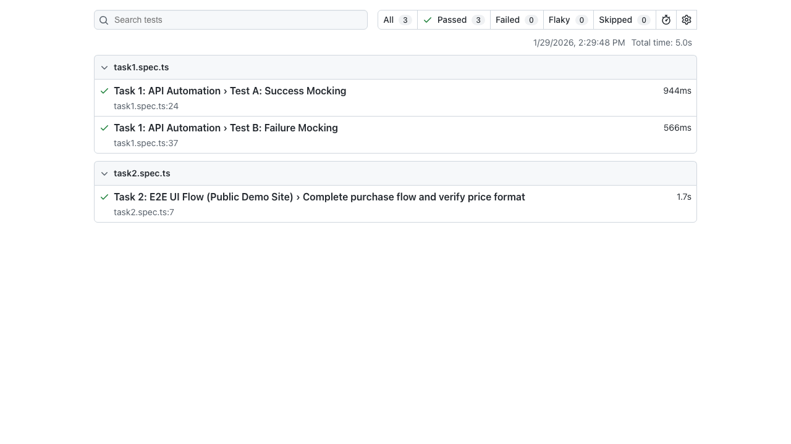

# Junior QA Automation Engineer Technical Task

This repository contains the solution for the Junior QA Automation Engineer technical task.

## Project Structure

- `tests/`: Contains the test scripts.
  - `task1.spec.ts`: API Automation (Mocking Strategy).
  - `task2.spec.ts`: E2E UI Flow (SauceDemo).
- `pages/`: Page Object Model (POM) classes for the UI tests.
- `task1/`: (Optional) Static HTML for Task 1 (though tests use in-line content for reliability).
- `playwright-report/`: Generated HTML test report.

## Prerequisites

- Node.js installed.
- npm installed.

## Installation

1. Clone the repository (or extract the files).
2. Install dependencies:
   ```bash
   npm install
   ```
3. Install Playwright browsers:
   ```bash
   npx playwright install chromium
   ```

## Running Tests

To run all tests:
```bash
npx playwright test
```

To view the HTML report:
```bash
npx playwright show-report
```

## Task Overview

### Task 1: API Automation (Mocking Strategy)
Mocks a `POST /api/transfer` endpoint using Playwright's `page.route`.
- **Test A (Success):** Mocks a 200 OK response and verifies UI reflects success.
- **Test B (Failure):** Mocks a 400 Bad Request response and verifies UI reflects error handling.

### Task 2: E2E UI Flow
Performs a full purchase flow on `https://www.saucedemo.com/`.
- Logs in with `standard_user`.
- Adds a product to the cart.
- Verifies the item is in the cart.
- **Fintech Twist:** Verifies the price format using regex (e.g., `$29.99`).

## Test Results Screenshot


